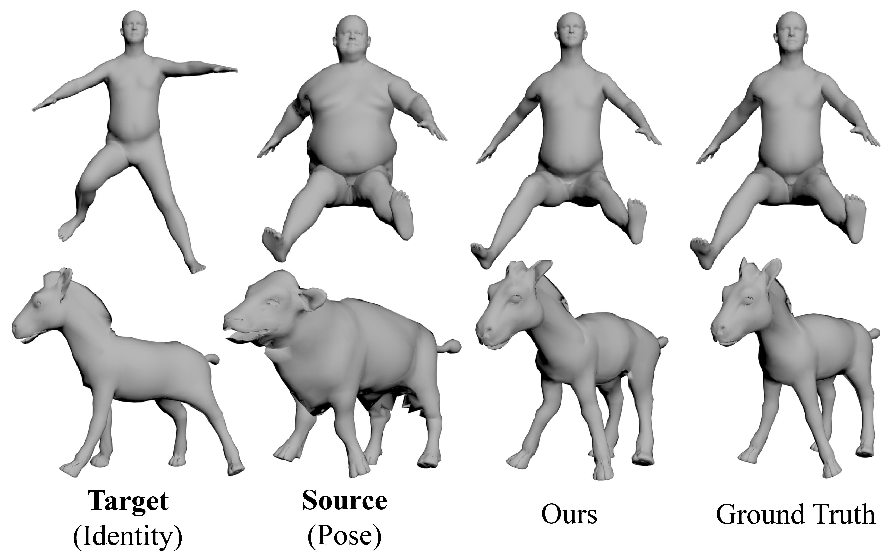

# Dual-Side Feature Fusion 3D Pose Transfer
This is an implementation of *FF-PTNet* proposed by the paper "Dual-Side Feature Fusion 3D Pose Transfer".  

 <br>
## Source Code
```bash
git clone https://github.com/YikiDragon/FF-PTNet.git
cd FF-PTNet
```
## Requirements
- python3.7
- numpy
- tqdm
- natsort
- pytorch == 1.13.0
- [torch-geometric](https://pytorch-geometric.readthedocs.io/en/latest/index.html)
- [trimesh](https://trimsh.org/index.html) == 3.20.2
```bash
conda create -n ff_ptnet python=3.7
conda activate ff_ptnet
# install pytorch and pyg
conda install pytorch==1.13.0 torchvision==0.14.0 torchaudio==0.13.0 pytorch-cuda=11.7 -c pytorch -c nvidia
conda install pyg -c pyg
# install trimesh
conda install -c conda-forge trimesh
# install other packages
pip install tqdm natsort
```
Our code has been tested with Python 3.7, Pytorch1.13.0, CUDA 11.7 on Ubuntu 20.04.

## Dataset and pre-trained model
We use [SMPL](https://smpl.is.tue.mpg.de/) as the human mesh data, and [SMAL](https://smal.is.tue.mpg.de/) as the animal mesh data.  
Please download them and pre-trained model [here](https://drive.google.com/drive/folders/19bGr3OE2ahU1AOawW-rmpDNca1EXlqna?usp=sharing).  
Run the following command in the root directory of the code to create the necessary folders:
```bash
mkdir datasets
mkdir saved_models
```
Unzip the downloaded datasets and move the folders `smpl` or `smal` into `datasets`. Then move the pre-trained models `model_smpl.pth` and `model_smal.pth` into `saved_models`.
## Demo
For SMPL(human), you can run the following command directly:
```bash
python demo.py
```
Then, the generated results will be in the `results` folder.

| Source mesh | Target mesh | Output mesh | Ground truth mesh |
|:-----------:|:----------:|:-----------:|:-----------------:|
| `po.obj`      | `id.obj`     | `out.obj`     | `gt.obj`            |

If you want to customize the input meshes, you can change the mesh file path in `demo.py`
```
path_po = './datasets/smpl/xxx.obj'     # source
path_id = './datasets/smpl/xxx.obj'     # target
path_gt = './datasets/smpl/xxx.obj'     # groundtruth(optional)
```
For SMAL(animal), you should change the parameter `model_name='model_smal.pth'`
```
v_out, mesh_pred = demo(path_id,
                        path_po,
                        model=FF_PTNet(),
                        model_name='model_smal.pth',  # 'model_smpl.pth' for smpl
                        path_gt=path_gt               # remove it if you haven't groundtruth mesh
                        )
```
## Training
For SMPL(human), make sure the datasets folder `smpl` is complete and correctly placed in `datasets`, and run `train.py` directly.
```
python train.py
```
For SMAL(animal), make sure the datasets folder `smal` is complete and correctly placed in `datasets`, change the dataset configuration in `train.py`
```
dataset = SMPLDataset(path='./datasets/smal/',
                      identity_num=40,
                      pose_num=600,
                      identity_range=(0, 23),
                      pose_range=(0, 299),
                      shuffle_points=True,
                      type='ply')
```
Then run `train.py`.
```
python train.py
```

## Evaluation
`eval.py` is the code for evaluation.

## Acknowledgement
Part of our code is based on [NPT](https://github.com/jiashunwang/Neural-Pose-Transfer) and [SEAN](https://github.com/ZPdesu/SEAN). Many thanks!

## License
MIT License
